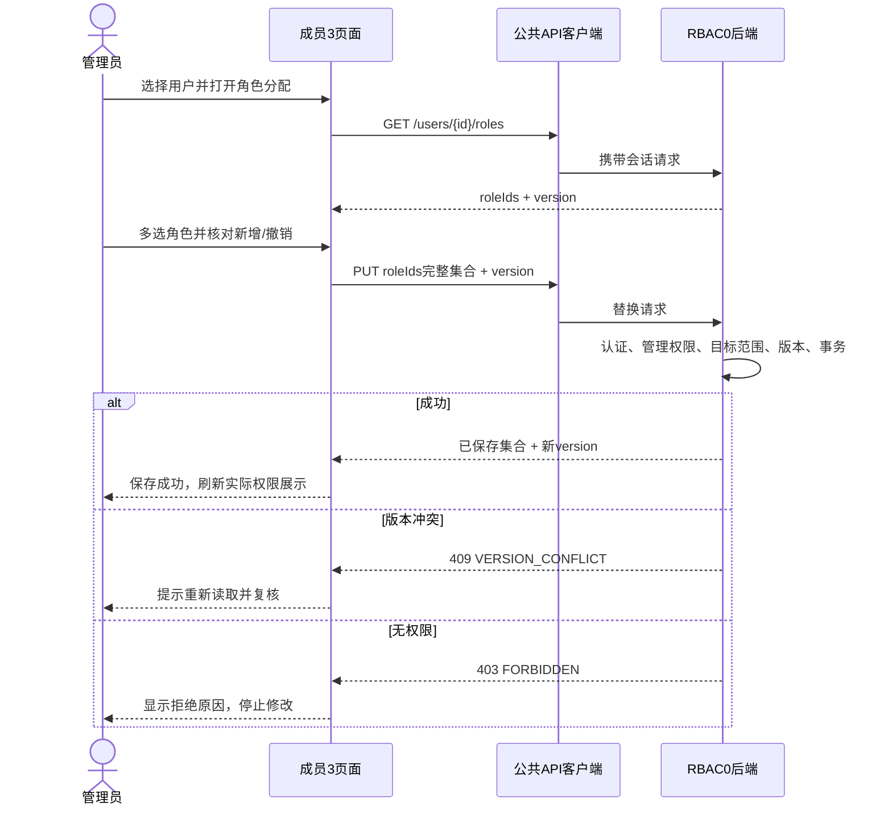

# 成员 3 第一阶段：RBAC0 角色权限交互设计

作者：杨昕桐（成员 3，前端 B）

阶段：2026 年 10 月 5 日起的准备阶段；对应第一阶段 RBAC0，课程验收窗口为 10 月 27—29 日

任务：GitHub [Issue #4](https://github.com/wenjiu-leng66/RBAC-Permission-System/issues/4)
状态：成员 3 设计与交互原型交付；真实后端联调、正式接口契约和课程验收仍待完成。

## 1. 我负责什么，为什么先做这些

原始分工中，成员 3 第一阶段负责“协助成员 2 搭建前端路由拦截，完成角色分配的基础前端逻辑”；仓库首批任务进一步要求“角色权限配置原型”，交付资源目录、角色分配、权限按钮规则和后续层级页面边界。

所以本次交付聚焦三个问题：管理员怎样给用户分配角色，怎样了解角色拥有的权限，以及用户怎样在界面上看到自己允许访问的菜单与按钮。RBAC1 的继承图和 RBAC2 的互斥约束只做后续边界说明，不在 RBAC0 中提前实现。

| 本次交付 | 文件 | 用途 |
| --- | --- | --- |
| 交互原型 | [member3-rbac0.html](../../frontend/prototypes/member3-rbac0.html) | 使用合成数据演示角色分配、资源目录、权限路由和按钮状态 |
| 权限判断核心 | [rbac0-policy.js](../../frontend/src/authorization/rbac0-policy.js) | 集中定义基础授权判断，方便后续 Vue 公共结构接入 |
| 设计说明 | 本文件 | 页面、状态、边界、协作步骤和验收预期 |
| API 使用方提案 | [member3-rbac0-consumer-needs.md](../../api/proposals/member3-rbac0-consumer-needs.md) | 提交给成员 4、6 统一约定的接口需求，不替代权威 OpenAPI |

成员 2 继续负责 Vue/React 公共结构、登录、用户和部门页面。本次没有建立另一套前端项目，也没有替代成员 4 编写后端。正式接口仍以 [api/openapi.yaml](../../api/openapi.yaml) 为准；准备阶段该文件的 `paths` 为空。

## 2. 先理解 RBAC0 的关系

RBAC0 由用户、角色、权限及两类分配关系组成。一个用户可以获分配多个角色；一个角色可以拥有多个权限；同一权限也可以属于多个角色。当前设计提议采用多角色界面，但实际账号初始化规则和原表岗位如何对应角色，仍需确认 [Q-11](../requirements/questions.md)。


在不含继承、不含显式拒绝、不含额外约束的 RBAC0 演示中，某用户的权限集合是其角色权限集合的并集，重复权限去重。没有匹配的权限即拒绝。原表中的“无”是否是显式拒绝、范围怎样合并，仍需教师确认，不能直接套入这个并集算法。

**登录成功只证明身份，不能自动取得管理权限。** 前端权限集合是后端返回的界面展示依据；真正允许读取或修改数据的决定必须由后端在每次请求时完成。

岗位名称也不是授权算法。原清单不满足完整的职位链权限包含关系，不能因为某人是领导，就在程序中自动补齐全部经理权限。

## 3. 数据来源与原型样例边界

已提供权限清单的分析规模是 18 个应用系统、115 个模块、359 个功能点。真实界面应支持检索、分页或逐层展开，不宜一次把所有功能和操作铺满屏幕。

原型使用 **3 个系统、6 个模块、10 个操作权限的合成目录样例**。它用于验证交互方式，并不表示已将 359 个功能点转换为稳定权限码，也不表示 Excel 全矩阵已经导入。样例用户、角色、授权关系不等同于真实员工数据。

权限清单中英文 `view`、空白、查看/编辑本人、全部和无的语义仍有待确认事项。正式导入需由成员 1、6 提供来源行号、清洗规则、稳定 ID 和角色映射；成员 3 再展示确认后的目录。

## 4. 资源目录与稳定权限码

建议的目录层次是：**应用系统 → 模块 → 功能点 → 操作权限**。系统、模块和功能点用于组织展示；最末级操作才是可授权的条目。不能给一个目录文件夹打勾，就默认授权它今后出现的所有功能。

例子：

```text
OA 办公系统
└─ 公文管理模块
   └─ 公文功能
      ├─ 查看    oa:document:read
      ├─ 新建    oa:document:create
      ├─ 编辑    oa:document:edit
      └─ 审批    oa:document:approve
```

这里的 OA、HR 命名用于合成示例，正式清单映射需与数据负责人统一。显示名称可以改成更易懂的中文，稳定权限码应保持不变。否则仅修改页面文案就可能使授权关系失效。

| 权限码草案 | 含义 | 界面用途 | 后端仍需检查 |
| --- | --- | --- | --- |
| `rbac:role:read` | 查看角色与授权情况 | 角色列表、角色详情 | 是否可查看目标角色 |
| `rbac:role:grant` | 修改角色权限 | 角色权限保存按钮 | 是否允许操作目标角色及授出这些权限 |
| `rbac:permission:read` | 查看资源权限目录 | 资源目录、授权选择项 | 目录可见范围 |
| `rbac:user:read` | 查看授权目标用户 | 用户选择列表 | 用户数据可见范围 |
| `rbac:user:assign-role` | 替换用户角色集合 | 角色分配保存按钮 | 是否允许给此用户分配这些角色 |
| `oa:document:read` | 查看公文 | 公文演示菜单与列表 | 数据范围、记录身份 |
| `oa:document:create` | 创建公文 | 新建按钮 | 提交内容与业务规则 |
| `oa:document:edit` | 编辑公文 | 编辑按钮 | 目标记录及本人/全部范围 |
| `oa:document:approve` | 审批公文 | 审批按钮 | 审批条件与允许的数据范围 |
| `hr:self:read` | 查看本人 HR 信息 | 本人信息演示入口 | 后端从会话取得本人 ID，不能信任 URL 中的 ID |

这是最低联调用权限码提案，不是完整生产权限字典。管理权限也应显式列出，不采用未知字符串、中文岗位名或不受控制的 `*` 通配符。

## 5. 页面一：角色分配

### 5.1 页面线框

```text
角色分配                             [刷新]
搜索姓名/员工号 [________________] [搜索]
┌ 用户列表（分页） ┐ ┌ 当前用户：演示用户 A ────────────┐
│ A  部门一        │ │ 已保存角色：公文查看员            │
│ B  部门二        │ │ [✓] 公文查看员  [ ] 公文编辑员     │
│ C  部门一        │ │ [ ] 权限管理员                    │
│ 上一页 / 下一页  │ │ 将授予：公文编辑员                │
└─────────────────┘ │ 将撤销：无                        │
                     │ [重置] [保存角色集合]             │
                     └───────────────────────────────────┘
```

“员工号”“部门”等字段显示范围应由成员 1、2、6 统一，不依赖本原型的合成用户字段。正式公共用户列表由成员 2 提供，成员 3 接收选中的稳定 `userId`。

### 5.2 多选、替换与撤销

1. 选择用户后，读取该用户已保存的角色集合和 `version`，把它作为“原集合”。
2. 多选框只修改“草稿集合”。勾选并不立即发送授权请求。
3. 差异摘要分别显示新分配与待撤销的角色。保留项不重复解释为新授权。
4. 保存时发送整个目标集合。`[A, B] → [B, C]` 的意思是撤销 A、保留 B、分配 C，不能当作只追加 B、C。
5. 用户明确取消所有勾选并保存 `roleIds: []`，表示撤销此用户全部角色。正常保存空集合和接口返回空集合都必须可表示。
6. 保存成功后以服务器返回结果更新原集合和版本。重置按钮只恢复草稿，不改服务器。

权限不足时不提供可操作的保存按钮，并展示必要的原因。即便有人通过浏览器修改 HTML 重新显示按钮，后端也必须拒绝未经允许的 PUT。

角色是否允许分配、管理员能否修改自己、最后一个管理员能否被撤销，都是管理策略问题，交给成员 4、6 确认并由后端实现；前端不自行假设可操作。

## 6. 页面二：角色权限配置与资源目录

### 6.1 页面线框

```text
角色权限配置
角色 [公文查看员 ▼]     搜索功能 [______________]
系统 [全部 ▼]           模块 [全部 ▼]
┌ 系统 / 模块 / 功能 ──┬ 操作权限 ────────────────┐
│ OA / 公文 / 公文     │ [✓]查看 [ ]新建 [ ]编辑 [ ]审批 │
│ HR / 人员 / 本人信息 │ [ ]查看本人                  │
└─────────────────────┴──────────────────────────┘
已选权限摘要：oa:document:read
新增 0 项，撤销 0 项                       [重置] [保存]
```

目录页还可以独立只读查看系统、模块、功能点和操作权限，不要求当前用户一定能修改授权。目录展示和授权修改分开判断，不能因为可见目录就提供保存能力。

### 6.2 全量目录的交互规则

- 提供关键词、系统、模块筛选和分页；切换筛选回到第一页。
- 后端总数与当前页数量分别展示。当前页为空是正常状态，不是接口失败。
- 勾选集合独立于当前页缓存，翻页不能丢掉前页的勾选，也不能把未加载的权限误判为已撤销。
- 如果未来提供“本页全选”，文案必须明确是本页，不能伪装成全目录授权。初期建议只提供逐项选择。
- 选择另一角色时，不能把前一个角色的草稿写给新角色。存在未保存修改时，由公共交互约定决定提示保存或放弃。
- 未知权限码、目录加载失败或权限数据尚未完成读取时，不能乐观地显示已获授权。

角色权限保存与用户角色保存采用相同的替换集合语义和并发版本检查。保存空 `permissionCodes` 集合意味着撤销该角色的全部直接权限，不意味着删除角色本身。

## 7. 菜单、路由与按钮怎样关联

正式路由由成员 2 在公共结构内集中注册，成员 3 提供权限元数据与判断函数。下表是关联提案，不是已部署的 Vue 路由契约。

| 页面/能力 | 读取入口所需权限草案 | 修改按钮所需权限草案 |
| --- | --- | --- |
| 角色信息 | `rbac:role:read` | 不自动提供修改能力 |
| 资源权限目录 | `rbac:permission:read` | 只读页面没有保存按钮 |
| 用户角色分配 | `rbac:user:read`、`rbac:role:read` | `rbac:user:assign-role` |
| 角色权限配置 | `rbac:role:read`、`rbac:permission:read` | `rbac:role:grant` |
| 公文演示 | `oa:document:read` | create/edit/approve 分别对应同名操作码 |
| 本人 HR 演示 | `hr:self:read` | 暂不设计修改能力 |

一条页面涉及多种必需读取权限时，提议采用 **AND**：必须全部具备才能进入；可选业务按钮单独判断。最终元数据名称和路由 URL 随成员 2 公共结构确认，不能六个人各写一套判断规则。

运行时权限策略接收的最小 UI 状态是：

```js
{
  authenticated: true,
  userId: "demo-u-001",
  permissionsLoaded: true,
  permissions: ["rbac:role:read", "oa:document:read"]
}
```

需要认证、没有成功加载权限、缺少精确权限码或权限元数据无效时，按默认拒绝处理。成员 2 的公共路由没有匹配地址时，可进入公共 404；授权函数遇到无效路由元数据则拒绝到 403。需要权限但没有权限的已知页面也走 403。菜单可见性、直接输入 URL 和按钮状态应共享判断核心，防止“菜单隐藏了，直接访问仍成功”的前端交互漏洞。

菜单隐藏和路由跳转只是界面控制。用户可以自己调用接口，所以后端不能信任传入的权限列表、用户 ID、部门或角色 ID，而应读取会话并检查目标资源。

## 8. 原型数据与未来真实接口怎样衔接

原型中的角色形状是 `{ id, permissionCodes, version }`，用户形状是 `{ id, roleIds, version }`。`version` 用于演示“读取后有人修改”时的冲突处理，不能把浏览器本地版本当作数据库并发控制已经实现。

API 提案采用当前有效权限接口返回 `permissionCodes: string[]`，可另外包含 `scopes`。适配器把 `permissionCodes` 转换成 UI 状态中的 `permissions` 字符串数组；`scopes` 留给正式业务页面解释与后端数据范围规则使用。

```text
成员 4 的后端验证会话
        ↓ 返回本人有效权限
成员 2 的统一 API 客户端 + 状态管理
        ↓ 适配 permissionCodes → permissions
成员 3 的授权核心
        ↓ 计算菜单 / 路由 / 按钮是否可见或可操作
成员 2 的公共页面结构 + 成员 3 的角色权限页面
```

例如，拥有 `oa:document:edit` 不说明可以编辑任何人的公文；`scope: self` 和目标公文归属仍由后端检查。当前精确码判断不完成本人数据验证。

## 9. 加载、空结果、失败和并发

| 状态 | 页面行为 | 禁止的做法 |
| --- | --- | --- |
| 首次加载 | 显示加载状态，编辑/保存暂不可用 | 权限还没回来就先允许操作 |
| 成功且有数据 | 展示服务器或原型实际返回值 | 把默认样例当作真实授权 |
| 成功但空结果 | 显示“没有角色/权限/匹配结果”，允许合法空集合 | 将空数组当作服务器故障 |
| 网络错误或 5xx | 保留可解释的错误与重试入口，不能宣称已保存 | 假提示保存成功 |
| 400 | 显示字段错误，保留草稿供修正 | 无条件重试同一请求 |
| 401 | 交由公共登录流程处理，清除失效权限状态 | 留着上个账号的菜单和数据 |
| 403 | 显示没有访问/修改权限，停止编辑并按需刷新权限 | 通过改 URL、隐藏错误继续保存 |
| 404 | 说明对象已不存在，返回列表或重新选择 | 给不存在用户/角色建立假详情 |
| 409 | 告知版本或规则冲突，重新获取当前值后让用户复核 | 自动重试覆盖他人的修改 |

### 9.1 防止旧请求覆盖新选择

用户快速从 A 切换到 B 时，A 的详情请求可能后返回。每次选择记录新的请求序号及目标 ID；只有“请求序号仍是当前序号，并且响应目标仍是当前用户/角色”时才回填页面。可额外用 `AbortController` 取消旧请求，但仅取消不能代替结果核对。

分页与检索请求同样处理，不能让上一筛选的结果覆盖新筛选。退出登录或切换账号后清理状态，使旧请求无法恢复前一个账号的资料。

### 9.2 防止重复保存与相互覆盖

保存期间禁用重复提交。后端提案使用 `version` 做乐观并发控制：读取版本 7，提交时仍带 7；如果服务器已是 8，返回 409，并且整个角色/权限集合保持未修改。

成功响应给出新的已保存集合与版本。失败时草稿仍可供复核，但不能把草稿改标为“已保存”。真实原子性、版本比较与数据库事务由后端完成。

## 10. 一个关键交互的时序



这是设计流程，尚未证明真实接口的行为。权限变更何时使已有会话生效、是否强制刷新/失效，需要成员 4、6 一并确认；前端不会把本地改完样例视为全系统立即撤权。

## 11. 后续 RBAC1 与 RBAC2 的边界

### RBAC1：角色层级

关系方向固定为 **senior 继承 junior 的权限**。例如“公文编辑能力角色”继承“公文查看能力角色”，并额外直接拥有编辑权限。这是能力关系示例，不是把公司职位等级直接当作继承规则。

层级是否只允许单父树，还是支持有向无环图 DAG 的多个父关系，仍待 Q-05。若采用 DAG，普通树状控件可以做投影展示，但不能导致重复节点、重复授权或误以为只有一个父关系。无论选择哪种，后端都应拒绝自环和间接环。

第一阶段仅保留扩展入口和相关设计说明，不计算继承闭包，不保存层级关系。

### RBAC2：静态与动态约束

候选例子：

| 类型 | 候选规则 | 触发时点 | 前端后续展示 |
| --- | --- | --- | --- |
| SSD 静态职责分离 | 同一用户不能同时被分配“申请提交者”和“申请审批者” | 用户角色分配 | 保存时明确哪些分配冲突 |
| DSD 动态职责分离 | 用户可以持有“付款经办”和“付款复核”，但同一会话不能同时激活 | 会话激活角色 | 展示已分配、已激活两个集合，并说明冲突 |

这些都是待老师和小组确认的教学候选，不能声称来自原市政公司矩阵；当前不实现这两类约束。DSD 不应误写为用户永远不能被分配两种角色。理论 RBAC2 与层级 RBAC1 独立，若最终系统同时保留层级和约束，应按 Q-04 说明课程命名与理论 RBAC3 的关系。

## 12. 我和成员 2、4、6 怎么接起来

| 对接人 | 对方需要交付 | 成员 3 提供/完成 | 对接完成标志 |
| --- | --- | --- | --- |
| 成员 2 陈清香 | Vue公共结构、登录状态、用户选择、统一请求客户端、403/404、页面样式约定 | 权限核心、角色/目录原型、路由及按钮元数据提案 | 页面不复制一套登录；公共状态能驱动成员3菜单/按钮 |
| 成员 4 王信凯 | RBAC0角色/目录/用户角色接口、后端鉴权、替换事务、版本冲突响应 | API使用方需求、边界情况、消费适配器设计 | 合同确认后能在测试库保存并读回，而不是只修改原型数据 |
| 成员 6 孙逸轩 | 正式OpenAPI、错误/分页/ID/会话约定、独立验收用例、目录清洗预期 | 本提案、页面状态与验收预期 | 提案结论写回OpenAPI；成员6依据独立预期验证允许和拒绝 |

建议按以下顺序执行：

1. 与成员 2 对接原型交互、目录结构和权限函数的导出方式，统一公共路由元数据。
2. 与成员 4、6 统一 API 提案，解决 ID、分页、替换、版本和授权时机问题。
3. 成员 6 更新权威 OpenAPI。接口未确认前继续使用合成样例，不猜测真实字段。
4. 成员 2 统一登录和 API 客户端，成员 3 把页面交互迁移进公共 Vue 项目，并只消费统一权限状态。
5. 对接成员 4 的测试后端：查询、保存、读回、刷新权限和错误分支逐项验证。
6. 成员 6 通过直接 HTTP 请求验证后端拒绝，不能只看按钮是否隐藏。
7. 作者完成自检和必要自动检查后，由负责人合并 PR，不设置人工评审等待环节；证据记录对应提交版本。

## 13. 第一阶段验收清单

以下是正式前端的验证目标。已完成的原型和权限模块检查见 [本次验证记录](../testing/member3-rbac0-verification.md)；下表“待实测”指正式工程或真实接口接入后的验证，不能从原型推断正式系统已通过。

| 编号 | 操作 | 预期 | 当前验证状态 |
| --- | --- | --- | --- |
| M3-01 | 未登录访问受保护页面 | 进入公共登录流程；无遗留权限 | 待实测 |
| M3-02 | 已登录但权限尚未成功加载 | 默认拒绝访问和保存 | 待实测 |
| M3-03 | 有读权限、无写权限 | 可读，不可保存 | 待实测 |
| M3-04 | 直接输入无权页面地址 | 拒绝进入，即使菜单不可见也一样 | 待实测 |
| M3-05 | 用户由角色[A,B]改为[B,C] | 新增C、撤销A、保留B | 待实测 |
| M3-06 | 保存空角色集合 | 用户全部角色被撤销，显示空状态 | 待实测 |
| M3-07 | 角色权限多选并翻页 | 保持所有页的草稿，不能错误删除未加载权限 | 待真实目录接口实测 |
| M3-08 | 快速切换用户/角色/筛选 | 旧响应不覆盖新目标 | 待实测 |
| M3-09 | 连续点保存 | 不重复提交 | 待实测 |
| M3-10 | 服务器版本已变化 | 409，不覆盖别人修改，允许重新读取 | 待后端联调 |
| M3-11 | 登录到另一个账号 | 权限和用户数据重新取得，旧状态清理 | 待公共登录联调 |
| M3-12 | 401/403/404/网络错误 | 展示相应反馈，不伪装保存成功 | 待后端联调 |
| M3-13 | 有编辑码但只有本人范围，改请求ID访问他人记录 | 后端拒绝；界面判断不能绕过 | 待后端联调 |
| M3-14 | 目录为空或搜索无匹配 | 正常空结果，不报系统失败 | 待实测 |

原型验证和单元检查只能证明原型范围内的行为，不能证明老师要求的真实数据库、服务端安全或整套系统已完成。正式证据建议保存场景、输入、预期、实际结果、截图或HTTP响应和提交 SHA。

## 14. 待确认的决策

- 多角色分配和原岗位到角色的初始化规则（Q-11）。
- 原矩阵的“无”、空白、全部、本人范围和角色合并规则（Q-07—Q-10）。
- 角色管理权是否允许授出任何权限，还是只能授出某个受限集合；是否限制自行修改和最后管理员撤权。
- 会话使用 Cookie 还是 Token，以及角色变更对现有会话生效的时点。
- 权限目录是否按上述层次提供、是否由服务端分页、稳定权限码如何与原表来源行对应。
- 版本字段、错误码、成功包络和页码起点，由成员 6 写入正式契约。
- RBAC1 单父树或多父 DAG、SSD/DSD 候选规则，由老师与小组确认。

有关边界仍以 [需求范围](../requirements/scope.md)、[问题清单](../requirements/questions.md) 和 [API约定草案](../standards/api-contract.md) 为准。设计提案不隐式关闭这些问题。
