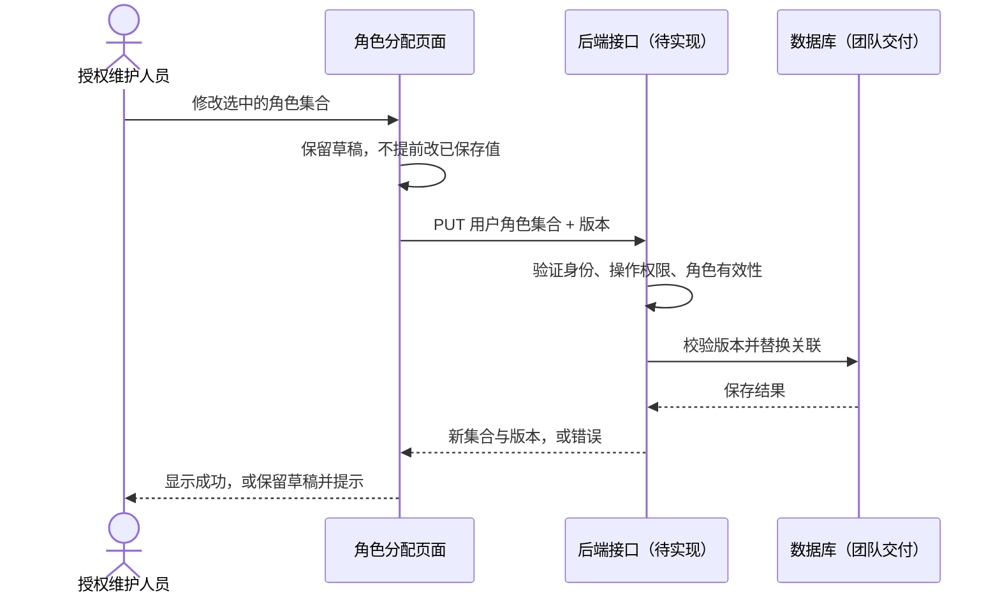

# 成员 3（杨昕桐）：RBAC0 阶段完成内容与学习说明

本文单独解释成员 3 这次交付：做了什么、为什么这样做、怎样运行和演示，以及怎样交给其他成员接入。

依据是仓库最新的 [六人分工](../planning/team.md)、[首次任务](../planning/first-tasks.md) 和你提供的均衡版课程分工表。当前按 2026 年 10 月 6 日的准备阶段处理，阶段一内部截止为 10 月 26 日，老师验收窗口为 10 月 27—29 日；照片没有写年份，时间仍以老师通知为准。

## 1. 你现在应该完成什么

你是前端开发 B。第一阶段重点是协助路由拦截、完成基础角色分配逻辑、角色与权限界面设计。角色继承树属于 RBAC1 阶段；互斥角色、会话激活和约束配置属于后续阶段。

本次按仓库成员 3 任务的要求，准备了以下交付：

| 交付 | 解决什么问题 | 位置 |
| --- | --- | --- |
| 可操作的 RBAC0 原型 | 让同学与老师可以操作角色授权、用户角色分配和资源目录 | [原型 HTML](../../frontend/prototypes/member3-rbac0.html) |
| 原型运行与演示说明 | 让其他成员无需安装框架就能复现交互 | [原型 README](../../frontend/prototypes/README.md) |
| 可复用权限判断模块 | 把按钮、菜单、路由的判断集中到同一处 | [rbac0-policy.js](../../frontend/src/authorization/rbac0-policy.js) |
| 权限逻辑测试 | 验证默认拒绝、多角色并集、撤销等规则 | [测试文件](../../tests/frontend/rbac0-policy.test.cjs) |
| 页面与协作设计 | 说明字段、状态、权限码、职责及后续阶段边界 | [设计说明](../design/member3-rbac0-design.md) |
| API 使用方提案 | 告诉后端与成员 6：这些页面需要哪些接口与返回字段 | [接口提案](../../api/proposals/member3-rbac0-consumer-needs.md) |

当前交付使用合成数据，在浏览器中演示前端交互。没有连接真实后端、没有导入真实员工、没有部署正式系统。原型可以完成本阶段设计与基础逻辑的展示，正式应用的框架接入和真实联调仍需要团队后续交付。

## 2. 为什么先做这套交互原型

成员 2 负责公共前端架构、登录、用户和部门页面。当前仓库还没有正式 Vue / React 工程，团队也没有确认全部版本与接口。

所以这次把成员 3 的工作做成无外部依赖的 HTML、CSS、JavaScript 原型，同时把权限判断抽成独立模块。这样你可以立即演示页面与操作，成员 2 随后也能把规则接到同一个正式前端项目中。

原型只是阶段交付的运行形式，不代表最终必须使用纯 HTML 开发。正式项目应继续使用团队确认的技术栈，并保留这次已经说明清楚的字段、交互与权限规则。

## 3. 先把 RBAC0 理解清楚

RBAC0 的基础关系是：**用户被分配角色，角色被授予权限，用户通过角色获得权限。**


举一个合成例子：

- 演示员工分配“文员”角色，该角色有 `oa:document:read` 和 `oa:document:create`。
- 同一个员工再分配“审批员”角色，该角色有 `oa:document:read` 和 `oa:document:approve`。
- 这个员工的基础有效权限是两个角色权限的并集：查看、新增、审批。
- 撤销“审批员”后，审批权限消失；查看权限仍可来自“文员”。

这里没有自动继承规则，不会因为一个角色听起来职位更高，就给予另一个角色的全部权限。原始权限矩阵也存在“公司领导能查看、部门经理能编辑”的例子，不能直接把职位顺序画成权限包含关系。

## 4. 页面分别做了什么

### 角色授权

维护“一个角色拥有哪些功能操作”。操作思路是选择角色，查看资源目录，勾选操作权限，再保存草稿。

必须区分两组数据：已经保存的授权集合与正在编辑的草稿集合。勾选不应立即改变正式授权；取消应回到已保存状态；保存失败应保留草稿并允许重试，不能显示成功却实际丢失。

资源按系统、模块、功能组织，操作由稳定权限码标识。当前使用少量合成资源演示交互，不声称已经把原表的 18 个系统、115 个模块、359 个功能全部导入。全量目录需要与成员 1、6 核对清洗和映射。

### 用户角色分配

维护“一个用户被分配哪些角色”。支持多选，保存的含义是**替换整个角色集合**，不是偷偷追加。

例如原先 `roleIds = [文员, 审批员]`，取消审批员后保存 `roleIds = [文员]`，就表示撤销审批员。清空所有角色也是明确的撤销操作，后端最终应检查操作者权限及其他业务规则。

姓名只用于展示，保存时使用用户 ID 与角色 ID。真实员工有重名，不能按姓名决定授权对象。

### 资源目录

把“系统 → 模块 → 功能 → 操作权限码”的关系显示出来，供同学对照和检索。

显示名称可以修改，权限码应保持稳定。例如“角色查看”显示名称可以调整，但前端路由、后端校验和测试仍使用同一个 `rbac:role:read`。

### 身份切换与访问反馈

原型提供不同的合成身份，便于演示：管理员能做什么、普通员工能做什么、未登录会发生什么。身份切换是演示控件，正式系统应由真实登录接口产生身份。

导航项与操作按钮会依据当前有效权限改变。直接输入页面地址仍要经过判断，不能只把菜单藏起来就认为页面已受保护。

## 5. 权限判断为什么单独抽成一个文件

如果每个页面分别写“是不是管理员”“是不是部门经理”，规则很快会分散，还会与真实权限表不一致。

这次统一采用几个小函数：

| 函数 | 用途 | 举例 |
| --- | --- | --- |
| `hasPermission(session, code)` | 当前会话有没有精确的操作权限码 | 决定“保存角色授权”按钮是否允许操作 |
| `canVisit(session, route)` | 当前会话能不能进入指定路由 | 未登录转登录；无权限转 403 |
| `visibleRoutes(session, routes)` | 得到可展示的导航项 | 普通员工不显示角色管理入口 |
| `effectivePermissionCodes(user, roles)` | 为原型计算用户的 RBAC0 角色权限并集 | 两个角色共同授予的权限去重 |

前三个函数可以供正式前端复用。最后一个函数主要服务于原型演示；真实应用的有效权限应由后端根据账号、角色状态和服务端规则计算，再返回给前端。

模块可由普通浏览器脚本加载，也可通过 CommonJS 在 Node.js 中测试。没有依赖 npm 第三方库。

### 会话字段

```javascript
const session = {
  authenticated: true,
  permissionsLoaded: true,
  userId: 'DEMO-user-example',
  permissions: ['rbac:role:read', 'oa:document:read']
};
```

- `authenticated`：身份是否已经确认。
- `permissionsLoaded`：是否已经取得有效权限；加载未完成时不能默认放行。
- `userId`：稳定用户标识。
- `permissions`：前端用于展示与导航的精确权限码集合。

这些字段是前端的本地表示，不等于已经确认了后端响应格式。接口提案如果包含数据范围，适配时要保留范围信息，并明确前端操作码检查不能替代服务端对象级检查。

### 路由字段

```javascript
const rolePage = {
  path: '/roles',
  requiredPermissions: ['rbac:role:read'],
  match: 'all'
};

Rbac0.canVisit(session, rolePage);
```

公开页面必须显式声明 `public: true`。受保护页面需要明确权限规则；未知页面、缺少规则、格式错误、身份未确认或权限未加载，都不能因为配置缺失而被放行。

`match: 'all'` 表示要求所有权限；`match: 'any'` 表示至少具备其中一个。没有明确使用 `any` 时，不应自行放宽。

## 6. 为什么既控制菜单，又控制路由和按钮

它们分别解决不同的界面问题：

| 层次 | 作用 | 不能代替什么 |
| --- | --- | --- |
| 菜单 | 不让用户看到不能使用的入口 | 不能阻止手工输入地址 |
| 路由 | 进入页面前检查身份与权限 | 不能阻止直接请求后端 API |
| 按钮 | 明确当前能执行哪些操作 | 不能阻止修改浏览器 JavaScript |
| 后端 | 校验真实身份、操作权限和数据范围 | 是最终授权依据 |

例如员工没有 `rbac:user:assign-role`，前端就不允许保存角色分配；即使有人绕过界面发送请求，后端仍必须拒绝。后端不能相信请求里自报的角色或“我是管理员”。

再如 `hr:self:read` 的演示页面只表示“本人资料入口”。实际后端还必须检查目标数据是否属于当前用户；不能因为页面显示了“本人”，就认为已经防止读取其他人的资料。

## 7. 怎样运行与演示

### 最简单的运行方式

1. 下载或克隆仓库。
2. 找到 `frontend/prototypes/member3-rbac0.html`，双击用浏览器打开。
3. HTML 会从同一份仓库的相对路径加载样式、原型脚本和权限模块。
4. 不要只复制一个 HTML 文件，它还依赖旁边的 CSS、JS 和 `frontend/src/authorization/rbac0-policy.js`。

如果需要通过本地服务查看，在仓库根目录运行：

```powershell
python -m http.server 4173 --bind 127.0.0.1 --directory frontend
```

浏览器访问 `http://127.0.0.1:4173/prototypes/member3-rbac0.html`。结束后在运行服务器的终端按 `Ctrl+C`。这只是本地静态预览，不是华为云部署。

### 建议按这个顺序给组员演示

1. 以演示管理员进入角色授权，查看一个角色的已保存权限。
2. 修改一个操作，观察草稿；点击取消，验证回到原状态。
3. 再修改并保存，切换对应的演示用户，观察菜单和操作是否随权限变化。
4. 在用户角色分配中给一个用户添加第二个角色，说明为什么得到的是权限并集。
5. 撤销该角色并保存，确认只移除由该角色独有的权限。
6. 切换为普通员工，直接在地址末尾输入 `#/roles`，展示受限页面反馈。
7. 切换为未登录身份，再访问受保护页面，展示登录提示。
8. 用原型状态模拟演示加载、空数据、保存失败与冲突，说明失败时不会伪装成保存成功。
9. 重置或刷新，确认恢复合成初始数据。

更准确的控件名称、示例角色与状态切换方式见 [原型 README](../../frontend/prototypes/README.md)。

## 8. 测试是怎样验证的

在仓库根目录、安装支持 `node:test` 的 Node.js 后运行：

```powershell
node --test tests/frontend/rbac0-policy.test.cjs
python scripts/check_repository.py
git diff --check
```

GitHub 工作流已增加 Node.js 22 环境运行权限测试，不需要 `npm install`。仓库 Python 检查仍按已有约定使用 Python 3.11 或以上。

测试重点是行为边界：未登录、权限未加载、权限码精确匹配、缺失规则默认拒绝、角色并集、重复权限去重、角色撤销以及 `all` / `any` 路由要求。它验证的是前端模块，不是后端授权或整套应用的安全测试。

本次实际测试和浏览器操作结果单独记录在 [验证记录](../testing/member3-rbac0-verification.md)。该记录区分自动化测试、浏览器交互与尚未开始的真实 API 联调，不把候选场景直接写成通过。

## 9. 怎样和其他成员合成一个应用

### 交给成员 2：共享前端

陈清香负责公共壳和正式工程。你交给她的是页面规则、原型交互、路由需要的权限码、按钮判断和权限模块。双方在同一个 `frontend/` 工程内协作，不各建一套应用。

正式接入时按这个顺序：

1. 确认团队采用 Vue 或 React，以及真实路由与状态管理方案。
2. 成员 2 建立统一 API 客户端、登录会话状态、布局与公共组件。
3. 把角色授权、用户角色分配和资源目录迁移成框架页面。
4. 将后端身份与权限响应适配成统一前端会话表示。
5. 在公共导航守卫中接入权限判断；未知路径、错误与登录跳转要避免循环。
6. 菜单和按钮复用同一套操作码；登录、退出、切换后端时清理旧权限。
7. 复用原型中的关键场景重新测试，不能只检查页面外观。

如果团队使用 Vue Router，可参考它的 [导航守卫](https://router.vuejs.org/guide/advanced/navigation-guards.html) 和 [路由元信息](https://router.vuejs.org/guide/advanced/meta.html)。父子路由的权限约定要明确，不能仅靠父子元信息覆盖而放宽保护范围；当前交付没有宣称已经初始化或接入 Vue Router。

### 交给成员 4、6：后端接口

王信凯负责 RBAC0 面向功能后端，孙逸轩统筹接口。你已提供 [API 使用方需求](../../api/proposals/member3-rbac0-consumer-needs.md)，包括读取角色、读取目录、替换角色集合和替换授权集合等需要。

它目前是提案：字段和路径经讨论后，由接口负责人更新 `api/openapi.yaml`。不要把原型中的内存修改当作后端保存，也不要同时维护两份互相冲突的正式标准。

### 交给成员 1：数据关联

郑凯负责真实数据、数据库和导入。你需要稳定的用户 ID、角色 ID、资源 ID，以及岗位到角色的已确认映射。姓名、页面排序和职位高低都不能替代这些 ID 或授权规则。

### 留给成员 5：后续实现

胡俊朗后续实现面向对象后端。同一前端应连接明确选定的一种后端，用同一接口契约验证；切换后端时重新确认身份与权限，不能混用两个实现的会话。

## 10. OOAD 课程里怎样解释你的设计

老师考察的不只是能点按钮，还包括你能否讲清需求、模型和设计为什么一致。

你可以用一个完整场景说明：

> 授权维护人员选择一个员工，调整其角色集合，保存后员工可使用的功能发生变化。前端负责输入、展示和错误反馈，后端负责验证身份、授权和保存，数据库保存用户与角色关系。



图里的后端过程是拟议协作流程，当前原型只模拟响应。它帮助小组确认输入、输出、错误和对象职责，没有把尚未实现的功能写成已完成。

## 11. 后续阶段需要你继续完成什么

| 阶段 | 后续工作 | 当前边界 |
| --- | --- | --- |
| RBAC0 | 接入正式工程、真实接口与全量目录，配合验收 | 原型与基础判断已准备；真实联调待团队接口 |
| RBAC1 | 角色继承关系展示与配置、有效权限来源解释 | 方向为 senior 继承 junior；是否多父 DAG 仍待确认 |
| 约束阶段 | SSD 角色分配冲突、DSD 会话激活冲突等页面 | 当前只写候选交互与错误反馈，不实现约束算法 |

例如“经办”和“审批”可作为互斥演示候选，但是否采用、互斥发生在分配还是激活、允许多少个角色，都需要老师和小组确认。不要把后续约束偷偷加进 RBAC0 测试规则。

## 12. GitHub 交付流程：取消评审等待

本次在 `feat/member3-rbac0` 分支准备交付，对应 [成员 3 任务 Issue #4](https://github.com/wenjiu-leng66/RBAC-Permission-System/issues/4)。按你的要求，取消强制人工评审及等待步骤。PR 用于保留变更和检查记录，作者完成必要验证后，由负责人直接合并，不需要等待其他成员点击 Approve。

协作手册、贡献流程和任务模板已同步调整为“认领任务 → 建分支 → 完成修改 → 自检与必要自动检查 → 合并 → 同步 main”。取消评审环节不会取消 RBAC0 阶段、测试或后续真实联调。涉及接口、数据和公共组件的约定仍需与对应负责人统一，避免两个模块无法连接。

你需要能亲自解释并演示：角色分配与角色授权的区别、权限并集、默认拒绝、按钮/路由/后端三层检查、失败为什么保留草稿，以及未来换成真实 API 时替换哪里。这份说明和可操作原型可以一起作为你的课程答辩材料。
