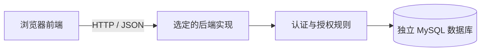

# UML 与架构资料

保留图的可编辑源文件。推荐按阶段命名和维护，例如 `rbac0-use-cases`、`authorization-sequence`、`role-hierarchy-design`。

需要准备：用例图、领域模型、设计类图、关键序列图、ER 图、组件图和部署图。老师具体要求优先。

分析类图表达业务概念，设计类图表达软件职责，ER 图表达持久化。图中的关系、多重性和调用应与实现对应。

当前仅有以下概念架构，未代表已经部署：

